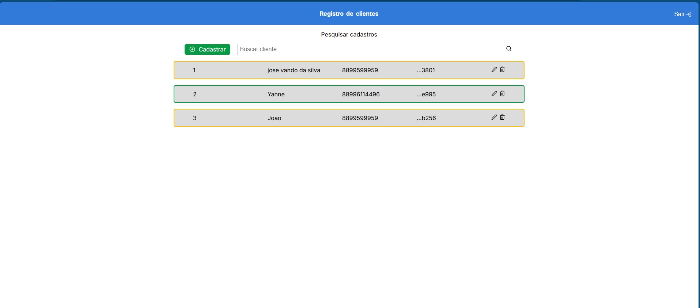
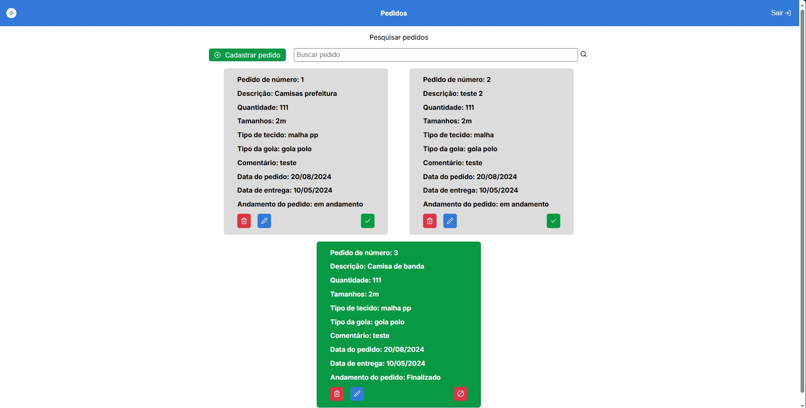

# KELPRINT
## Aplicação de Gestão de Clientes e Pedidos



## Visão Geral
Esta aplicação é um projeto de front-end desenvolvido com Next.js, TypeScript e styled-components. Ela oferece uma interface limpa e intuitiva para a gestão de clientes e seus pedidos. A aplicação se comunica com uma API backend para realizar operações de CRUD (Criar, Ler, Atualizar, Deletar) em clientes e pedidos.

## Funcionalidades
- **Gestão de Clientes**:
  - Criar novos clientes
  - Editar informações de clientes existentes
  - Deletar clientes
  - Visualizar a lista de todos os clientes

- **Gestão de Pedidos**:
  - Criar novos pedidos para cada cliente
  - Editar detalhes dos pedidos
  - Deletar pedidos
  - Visualizar todos os pedidos associados a cada cliente



## Tecnologias Utilizadas
- **Next.js**: Um framework React para construir aplicações rápidas e renderizadas no servidor.
- **TypeScript**: Um superconjunto de JavaScript com tipagem estática que melhora a qualidade e a manutenibilidade do código.
- **styled-components**: Uma biblioteca para estilizar componentes React com literais de template, proporcionando uma maneira prática de lidar com CSS-in-JS.

## Integração com a API
A aplicação se comunica com uma API RESTful construída com Java Spring Boot, utilizando PostgreSQL como banco de dados. Os endpoints da API lidam com as operações necessárias para gerenciar clientes e seus pedidos.

### Instalação e Configuração
1. **Clone o repositório**:
   ```bash
   git clone https://github.com/seu-repositorio/gestao-clientes-pedidos.git
